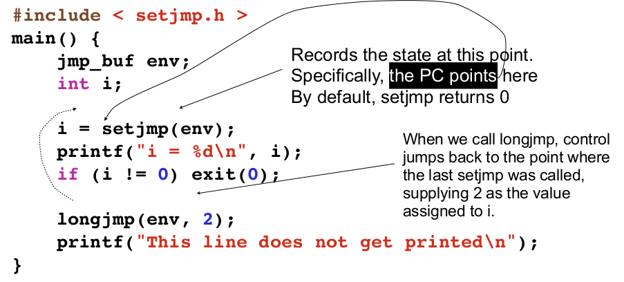

# C语言中的 setjump和longjump

C语言中可以使用过程间跳转，setjump设置一个lable，longjump函数可以跳转到这个label。

```c
#include <setjmp.h>
//setjump返回0表示第一次运行，否则返回longjump函数传入的val
int setjmp(jmp_buf env);

//env是setjmp函数保存的上下文，val表示setjmp即将返回的值，如果设为0则setjump返回1。
void longjmp(jmp_buf env, int val);
```

如下图所示：




一个捕获除数为0的例子:

```c
#include <setjmp.h>
#include <stdio.h>
#include <stdlib.h>

int main(int argc, char const *argv[])
{
    jmp_buf env;
    int i;

    i = setjmp(env);

    printf("i=%d\n",i);
    if(i!=0) exit(0);
    
    longjmp(env, 2);
    printf("never reached here!");


    return 0;
}

```

