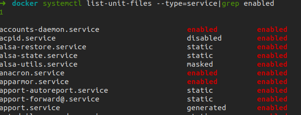

# Linux一些常用的命令

1. ssh通过设置-o可以保持连接，从而在闲停时不会被中断

   ```bash
   ssh -o ServerAliveInterval=60 user@sshserver
   #expample
   ssh -o ServerAliveInterval=60 gpf@192.168.0.1
   ```

2. [gdb常用](https://www.yanbinghu.com/2019/04/20/41283.html)

3. 查看与关闭开机自启动服务

   ```bash
   #查看开机自启动服务，其中enabled表示开机自启动的
   systemctl list-unit-files --type=service|grep enabled
   #关闭开机自启动服务，如mysql
   sudo systemctl disable mysql.service
   #打开开机自启动服务
   sudo systemctl enable mysql.service
   ```

   
